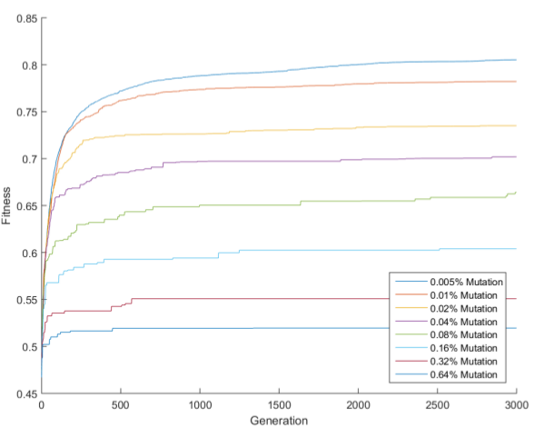

# Image Generation Using Shapes with Genetic Algorithm

__Authors: ELİF CANSU YILDIZ - SALİH MARANGOZ__

   * [Image Generation Using Shapes with Genetic Algorithm](#image-generation-using-shapes-with-genetic-algorithm)
      * [Genetic Algorithm](#genetic-algorithm)
      * [Goal of This Project](#goal-of-this-project)
      * [How to Run](#how-to-run)
      * [Parameters](#parameters)
      * [Implementation Details](#implementation-details)
      * [Results](#results)
      * [Challenges](#challenges)
      * [Other Examples](#other-examples)
      * [References](#references)

## Genetic Algorithm

A genetic algorithm is a search heuristic that is inspired by Charles Darwin’s theory of natural evolution. This algorithm reflects the process of natural selection where the fittest individuals are selected for reproduction in order to produce offspring of the next generation.

Five phases are considered in a genetic algorithm.

1. Initial population
2. Fitness function
3. Selection
4. Crossover
5. Mutation


For more explanation about genetic algorithms, you can follow this [website](https://towardsdatascience.com/introduction-to-genetic-algorithms-including-example-code-e396e98d8bf3)


## Goal of This Project

Using different types of shapes (circle, rectangular, square), it is aimed to make similar to selected image. For example these outputs are from aproximately **3000th** generation.

Lenna             | Girl with a Pearl Earring 
:-------------------------:|:-------------------------:
 |  


## How to Run

Java Runtime required to run this project. For Windows and Linux users there are scripts in `bin` folder. Parameteres can be modified in these files. Generated images for each epoch will be located in `bin/generated_images` folder.

```bash
$ bash bin/start.sh
```


## Parameters

- **IMAGE_FILE** (default = `"image.png"`)
  - Input image file path.
- **SHAPE** (default = `"square"`)
  - Shapes used for generating new image. Valid parameters are; "square", "circle", "triangle".
- **OUTPUTFILE** (default = `"generated_images/image_"`)
  - Prefix for generated image file name. 
- **SAVEOUTPUTS** (default = `1`)
  - If this value is 1, outputs will be saved which contain OUTPUTFILE prefix and generation number postfix.
- **PICTUREMETHOD** (default = `0`)
  - 0 = `Transparent Shapes`, 1 = `Opaque Shapes`
- **NUMOFPICTURE** (default = `50`)
  - Number of pictures in a generation.
- **NUMOFSHAPE** (default = `500`)
  - Number of shapes in a picture.
- **GENERATION** (default = `5000`)
  - Max number of generation (iteration).
- **SELECTIONRATE** (default = `0.30`)
  - If this value is 0.30, first %30 best pictures will selected for next generation, others will be deleted. New generation will be inherited from selected ones.
- **MUTUATIONRATE** (default = `0.001`)
  - With this probability a shape's parameters will assigned randomly.


## Implementation Details

- **Genetic** (Class)
  - Genetic algorithm implementation.

- **ImageUtil** (Class)
  - Utility class for image copy, resize, load, compare operations.
- **RandomGenerator** (Class)
  - Random number generator for colors and all primitive variables.
- **Screen** (Class)
  - GUI class for representing generated images and original image.
- **Picture** (Class)
  - Picture class which holds many paintable shapes in itself.
- **Paintable** (Interface)
  - A paintable object must be able to paint itself into `Picture` and mutate (randomize) itself.
- **Circle / Square / Triangle** (Class)
  - Some shapes that implements `Paintable` interface.


## Results

Chart of Fitness Values According to Mutuation Rates:



Chart of Fitness Values According to Types of Shapes:


Chart of Fitness Values According to Population Rates :


## Challenges

- **Problem:** Mutation doesn't affect shapes which are located under others'.
  - Mutated shapes will locate at the top. And addition to this solution there are transparent shapes option alongside to opaque shapes.

- **Problem:** Distance between pictures is not realistic.
  - HSB color space is used instead of RGB color space. Also manhattan distance used instead of euclidian distance.
- **Problem:** Shape sizes are not good.
  - Shape size limited to picture's half size in each dimension.


## Other Examples

All images generated in 3000 generations.


## References

https://www.java-tips.org/java-se-tips-100019/27-java-awt-geom.html
